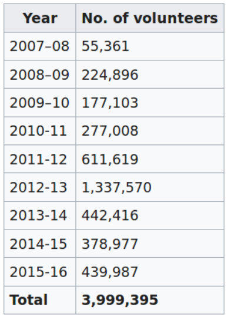
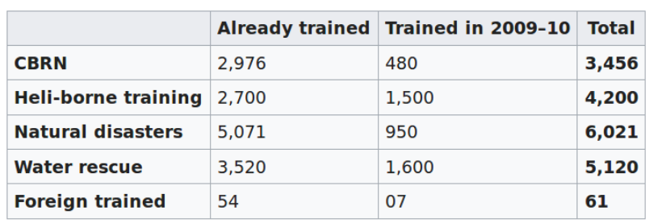
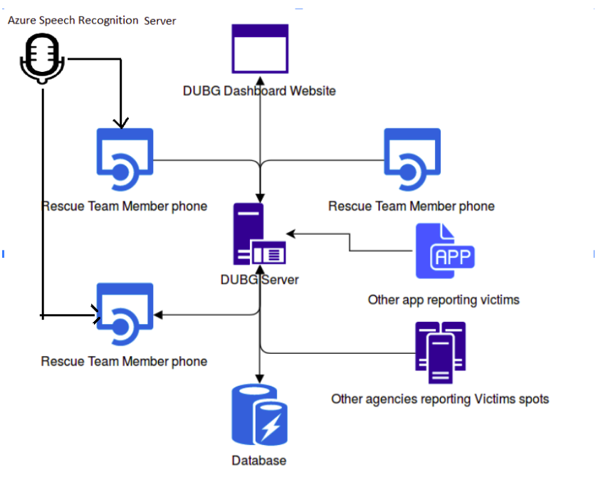

	 	 	

# DUBG

## DisasterUnknown's Battleground – Mixed Reality app for effective post disaster management

# **The team**

**Vivek Raj, **Indian Institute Of Technology Guwahati, Computer Science and Engineering, B.Tech, 2020 - Loves to automate daily tasks, interested in serious TV shows

**Ekagra Ranjan,** Indian Institute Of Technology Guwahati, Electronics and Communication Engineering, B.Tech, 2020 - Interested in Artificial Intelligence, likes to watch standup comedy

**Pavan Kumar, **Indian Institute Of Technology Guwahati, Computer Science and Engineering B.Tech, 2020 - Loves to make things with code, 

# **The Concept**

In the event of a catastrophe, the affected population gets broadly divided into 2 categories: victims and the rescuers. A disaster can take thousands of human lives and can put millions at stake. After a disaster, attending the victims becomes the top priority because they still have a chance to survive. In such situations everything boils down to the ability of the victims and rescuers to communicate with each other easily and effectively. This is the most important requirement for any rescue operation to be successfully carried and it decides whether a victim survives or not. With this problem in mind, we have built DUBG. 

DUBG is a mixed reality app for efficient post disaster management. Rescuer teams are very busy during operation, which is why we built our app based on Mixed Reality so that the **rescuers don't waste time on planning their rescue drive and operating any device for communication. **Our vision is to create an Augmented Reality (AR) based navigation system which disaster rescue team can use in a hassle free manner. 

**The features of our application can also be extended to help army to communicate and coordinate efficaciously in unknown terrains. **

## **Features:**

*   **AR Navigation functionality** which allows rescuers to view the route to the affected area through Augmented Reality. This allows the users to navigate easily even at night or in sandy dust storm when their vision is obstructed due to particles or improper lighting conditions. This prevents the delay in action of rescue teams in critical situations.
*   For effective communication we have added a feature of **AR Notification**. This feature makes it possible for messages to be projected in AR on the location of the sender. It allows receivers to view important messages, like informing other rescue teams about road blockage or current status of victims, to be hovering in AR space. This makes messages to be viewed as per the convenience of receiver just like in some situation people prefer messages over calls because of the choice to view and respond as per their convenience. AR notification prevents unnecessary distraction of rescue teams with information not required by the team at that moment.
*   The AR functionality can also be used to **see the live status updates** of other rescue teams and status of victims **on the AR space**. This save time as it removes the need to contact the headquarter or someone else to get the status.
*   For victims stuck at the disaster location, we have created an SOS API endpoint where other apps or agencies can also report the victim status so that our rescue team members can see those.
*   For victims stuck at the disaster location, we have created an **SOS API endpoint** where any 3rd party app for eg general utility apps or mobile games can provide an emergency like button which will report the status of the victims This will make the reporting the status of victims easier and will increase the visibility of victims to the rescuers and will make our product more universal.
*   The website has a **dashboard **which show the location of affected areas on map to give a sense of the magnitude of the disaster. The helpers can also report the status of Victims through the DUBG website.

## **Connectivity Issues:**

Our features involving AR markers like AR Navigation does not require continuous internet connectivity as it based on GPS. Professional map softwares requires us to download large data to render the whole world. On the other hand we require only the data-points between the source and destination which is portrayed on the camera feed for rendering. This increases the feasibility of our solution in the disaster struck areas with poor internet connectivity.

Apart from this, we can implement a P2P network for the app which could work both with bluetooth and Wifi. This will ensure that the app can exchange information even when there is no internet access.

## **Target Audience or Market:**

The report is based on EM-DAT data from the period between 1994 and 2013, which includes 6,873 natural disasters worldwide, which claimed 1.35 million lives or almost 68,000 lives on average each year, and affected 218 million people on average per annum during this 20-year period.

We target disaster relief organisation as main audience. NDRF generally deploys hundreds of rescuers. Therefore, even if we initially launch our app in India, we can sell thousands of headset. We can create a demand for our headset if we can make it useful enough for efficient coordination and navigation. NDRF also specifically trains people and has a specialist force for level three disasters. NDRF has more than 12515 successful trainees as of now.

Year-wise number of community volunteers trained by NDRF

If we can convince government and rescue agencies to distribute headsets to Volunteers, our demand will further increase.

Trained officials of NDRF

And this is just the case of a single Disaster relief of India. These trained officials and volunteers are main target.

These stats are only for one country. Every country in the world has similar needs in the event of a disaster which makes our product to be useful globally. Expanding our idea to help military people to communicate with each in a battleground, we will be adding a new dimension to the utility provided by our product which will further increase our audience.   

## **Feedback**

##  We took feedbacks from mentors from codefundo++ for areas of improvement.

*   Based on the feedback by codefundo++ mentors, we have integrated Speech API for voice recognition to make the whole experience hands free and thus save more time of the users.
*   We can also provide the functionality of face recognition using Face API to identify an individual in a crowd. Doctors can use this feature to identify and attend a patient who has reported to be in a critical situation in their SOS. This will be helpful especially  in densely populated relief camps where the doctor has just arrived and is not aware of the exact location of the patient.
*   For victims attaching a message in their SOS, we can detect the severity of the distress and assign a proper priority to it using natural language processing apis of Microsoft. This can be further extended to social network website where people may post about a person missing and further details about them. These messages can be processed to extract only important information about the missing person and file a complaint to the local authorities.

# **How it works:**

Using the current technology of Microsoft such as Mixed Reality and Speech Recognition, we can completely reimagine current Disaster Management systems. 

*   Implementing AR navigation, AR messages and live status updates in Mixed Reality with voice commands will make the basic tasks like communication, navigation and current status monitoring very easy for rescuers.
*   Adding speech features simplifies the task of sending AR Notifications (messages) and navigating around during rescue drives by eliminating touch input for most of the tasks and making the whole experience handsfree.
*   The app make the AR markers by calculating the relative GPS coordinates of markers with respect our location. Using basic smartphone sensors like GPS, compass and accelerometer, the app is able change AR markers in real time.

Architectural diagram for our application

## **Core Technologies**

*   The AR runs on **Beyond AR framework**. 
*   The server maintaining all the data is made with **Django Framework** and an API is made in it for users to upload data to the server through different sources, for reporting victims, road blocks, etc. 
*   **Azure Speech API** is used to control the headset using only voice commands. 
*   The headset runs using only **GPS** data when there is very less connectivity. 

## **Competition:**

The area we are targeting is very new and hot. The technology in this domain is rapidly evolving. There isn't any well established competition to our product. Edgybees seems to be the only service out there which can compete with us. 

Edgybees is a product which helps with tactical support in disaster management. Their model depends on hardware heavily like drones and is controlled centrally from one place and gives aerial view only. The main purpose of their service is to provide a 3D map and AR visualisation of any surrounding. As of now they are not our direct competitor but instead a service with which we can collaborate to get the accurate AR maps of surrounding and enrich our user experience. However, Edgybees has almost all the tools necessary to enter our space and give us a competition.

But even if they try to enter our space, we have a clear edge on them! Our product has the advantage of catering the help to every single individual in the rescue team, by showing the markers and information on every rescuer's headset. The customer can purchase single units of our product as per the requirement and can purchase more if they find it useful. The running maintenance of our product is also lesser than the heavy machineries like drones of Edgybees which makes our service low cost nature compared to them. Our product also provides personalised assistance to each person which makes our product stand-out from the competition. 

Google Maps is working on an AR navigation system, but they lack the real-time data changes and communication we give to users, which is very much important for the rescuers and soldiers to work together on their missions.

We believe that with our innovation and our right timing, we can capitalize the market for disaster management. 

# **Future Implementations:**

1.  We wish to port our solutions to a mixed reality headset.
1.  A Yes/No validation after sending a voice command to confirm the voice input.
1.  Make a complete HUD as is displayed in popular games. This will make our headset non-intrusive and still keep the essence of handsfree operation.
1.  Rescue team members can mark a markers as assigned to him. This will improve the overall team cooperation.

<!-- Docs to Markdown version 1.0β14 -->

## Videos

[Youtube link](https://www.youtube.com/watch?v=LtjAzuIrFk0)

## App Installation Instructions: 
Visit https://github.com/codervivek/DUBG/tree/master/app and install the dubg.apk file in an android phone. Give all the permissions required while installing for proper functioning of the app.   

## Authors

* **Vivek Raj**  - [DUBG](https://github.com/codervivek/dubg)
* **[Ekagra Ranjan](https://github.com/ekagra-ranjan)**
* **[Pavan Kumar](https://github.com/pavan71198)**
